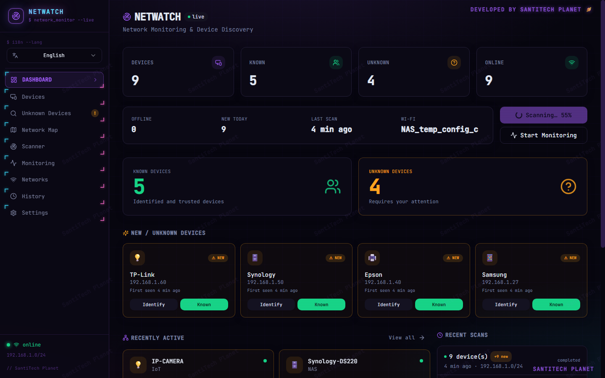
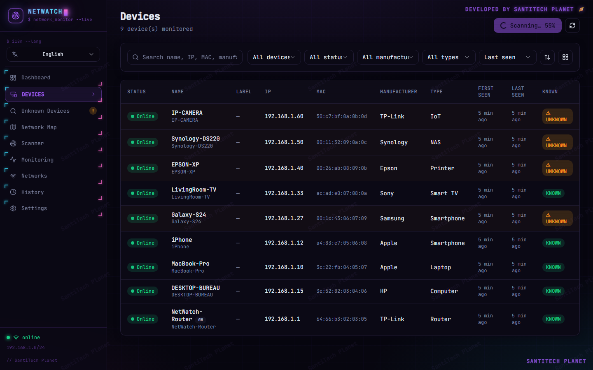
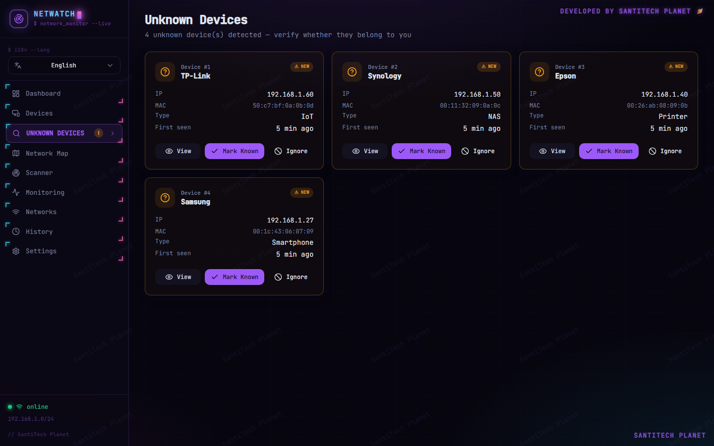
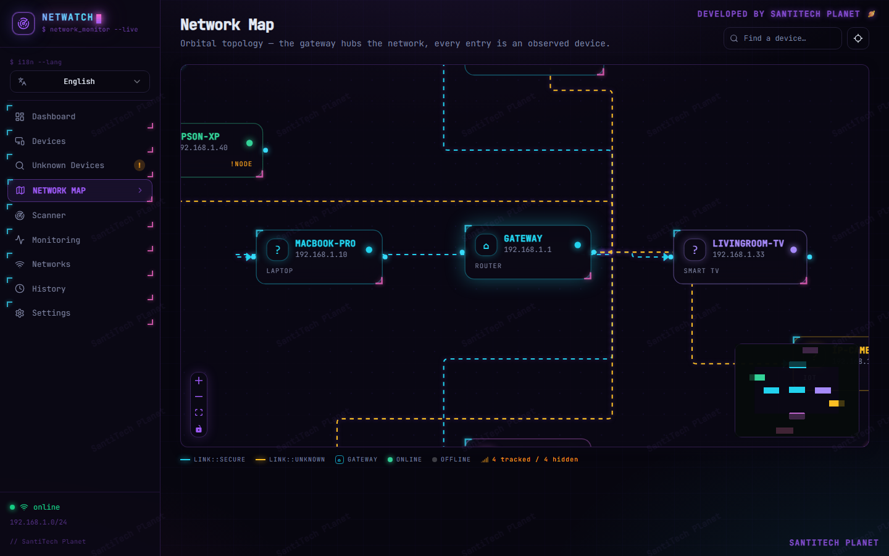
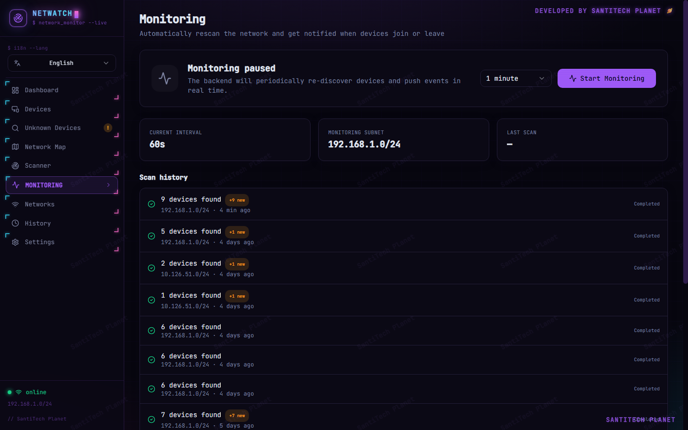
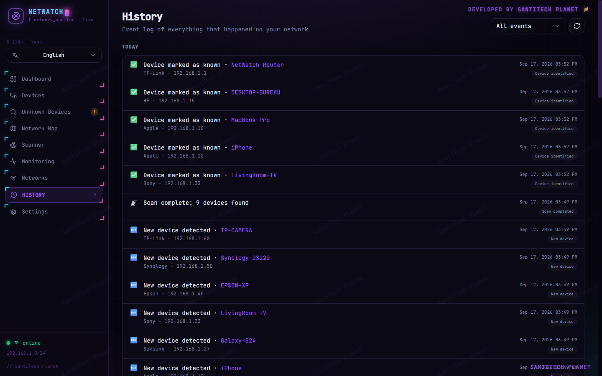
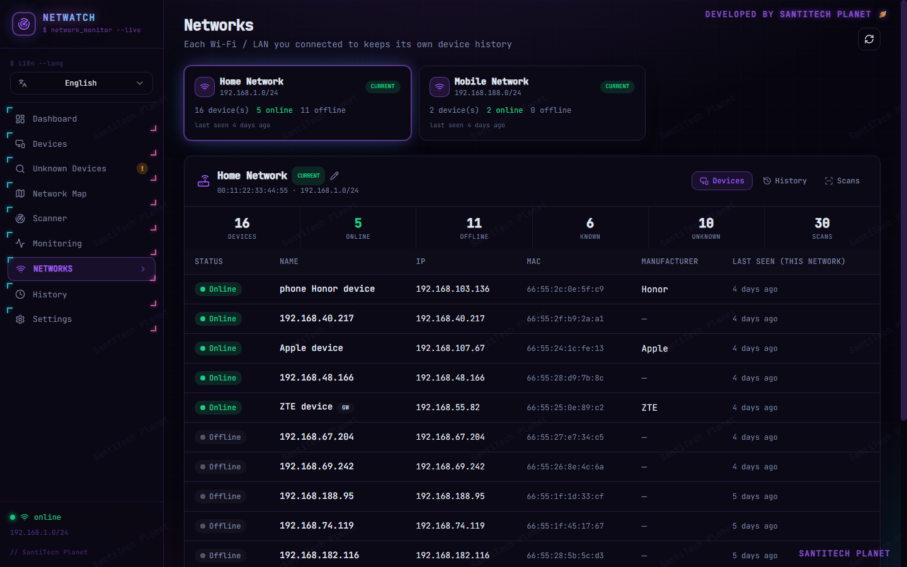
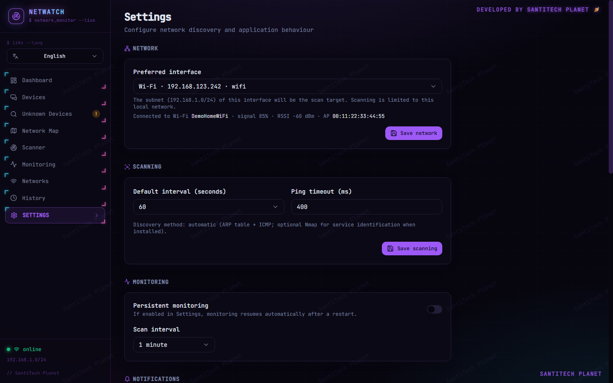

# NetWatch - Local Wi-Fi Network Supervisor (Windows / macOS / Linux)

> Real-time surveillance of who is connected to your Wi-Fi/LAN, running
> **100% locally** on your own machine - no cloud, your data never leaves
> your PC. 🛡️

**NetWatch** listens to your local network, discovers every connected device
(phones, PCs, printers, cameras, smart TVs, routers, smart speakers...),
identifies them by manufacturer and by device type, alerts you the second an
**unknown** device shows up, keeps a full history, and gives you a live map
of your network.

---

## Highlights 🎯

| | Feature | What it does for you |
|---|---|---|
| 1 | **Local discovery** 🤝 | ARP-table + parallel ping sweep of your subnet. Finds IP, MAC, vendor (OUI), hostname, mDNS identity (AirPlay, Google Cast, Mi Share...). |
| 2 | **Honest identification** 🔍 | Type + manufacturer with a *confidence level* - never guesses when it can't tell. |
| 3 | **Unknown-device alerts** 🚨 | Instant notification when a new/unknown device joins your network (WebSocket, realtime). |
| 4 | **Network map** 🗺️ | Interactive topology showing your router/hub and every device around it, with explicit "assumed connection" labels. |
| 5 | **Continuous monitoring** ⏱️ | Scheduled scans track who is online/offline, with per-device presence history. |
| 6 | **History & events** 🕓 | Every event logged and timestamped; export to CSV/JSON. |
| 7 | **Dark UI** 🌙 | Modern React dashboard with device cards, scan progress, alerts and live refresh. |
| 8 | **Demo mode** 🎮 | Fully working simulated network (9 mock devices) to try the whole UI offline. |

---

## Technology ⚙️

- **Backend (Python)** -> FastAPI, SQLAlchemy 2, SQLite, WebSocket events,
  multiprocessing ping sweep, mDNS collector, optional Nmap (OS detection).
  Runs entirely on `127.0.0.1` - no cloud, data stays local.
- **Frontend (TypeScript)** -> React 18, Vite, Tailwind CSS, React Flow
  (topology map).
- **Licensing** -> per-customer signed license key (Ed25519); one key = one
  machine. Activation can be offline (signed key) or online (Firestore).

---

## Screens / UI 🖥️

Cross-platform (Windows / macOS / Linux). The interface looks like this
(dark theme):

### Dashboard 🖥️

### Devices 📱

### Unknown devices ❓

### Network map 🗺️

### Monitoring 👁️

### History 🕑

### Networks 🌐

### Settings ⚙️

---

## Getting the source code 💾

The full source code (backend + frontend + build scripts + licensing) is sold
on a **per-customer private license**. You receive the source once, use it for
your own monitoring, and it ships signed to a single machine.

### Payment - how to buy 💳

**Price: 75 USDT** (exactly). Payment is accepted **only in USDT** on the
**TRON (TRC20)** network.

1. 📲 Open **any** TRON wallet (Trust Wallet / TronLink / TokenPocket /
   imToken...). You can also open it in any wallet app on your phone.
2. 📋 Copy the address from the wallet frame below and send **exactly 75 USDT**
   on the **TRC20** network:

   

   `
   TAWashKeNiEjFo2sGz8WxD9r3ysUbouBFJ
   `

   ⚠️ **TRC20 only.** Sending on another network (e.g. ERC20, BEP20) may result
   in permanent loss of funds.

3. 📨 Send your payment proof (TXID) to **santitechplanet@protonmail.com** to receive your private
   source delivery.

---
## License 📜

Licensed per customer, non-transferable. Reverse engineering, redistribution
and multi-machine sharing of a single license are prohibited. The app verifies
its signed license at startup and activates on the first machine only.
